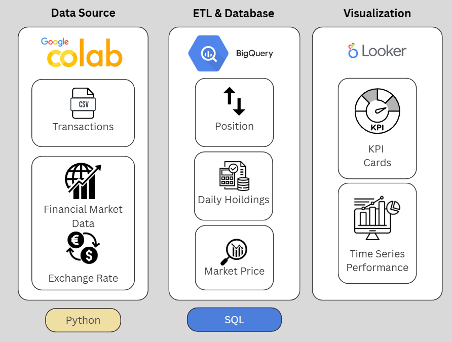

# 💼 Investment Portfolio Analytics Pipeline  
**End-to-End Workflow: Python → BigQuery → Looker**  
_Focus: SQL-driven analytics and financial data modeling_


## Overview  

This project demonstrates a **complete investment analytics workflow**, from data ingestion in **Google Colab** to SQL modeling in **BigQuery**, with results visualized in **Looker Studio**.  

The main objective is to compute **daily holdings, portfolio valuation, and PnL** using live market and FX data — focusing on **data modeling and SQL performance analytics** rather than front-end visualization.


## System Architecture  


**Data Source (Python / Colab)**  
- Read simulated monthly investment transactions  
- Fetch ETF and benchmark prices via `yfinance`  
- Download EUR/USD exchange rates from API  
- Upload clean datasets to **BigQuery Sandbox**

**ETL & Database (SQL / BigQuery)**  
- Calculate purchase quantity and daily positions  
- Compute market value, invested capital, PnL and returns (in EUR)  
- Aggregate holdings into a daily portfolio view  
- Optional: Join S&P 500 benchmark for performance comparison  

**Visualization (Looker Studio)**  
- KPI cards: Total Invested, Market Value, PnL, Return %  
- Time Series: Invested vs. Market Value vs. Benchmark  
*(Visualization is intentionally simple — the focus is on SQL modeling.)*


## Scenario: Investment Plan Assumptions  

- **Start date:** 1 Nov 2022 → 2 Sep 2025 (≈ 3 years)  
- **Monthly contribution:** €300  
- **Investment frequency:** 1st of each month  
- **Portfolio currency:** EUR (but using USD-denominated ETFs)

| Asset Class | Example ETF / Ticker | Allocation | Rationale |
|--------------|----------------------|-------------|------------|
| US Equities | **SPY** (S&P 500 ETF) | 40 % | Broad US market exposure |
| European Equities | **VGK** (Vanguard FTSE Europe ETF) | 20 % | Regional diversification |
| Global Bonds | **BNDX** (Intl. Bond ETF) | 20 % | Defensive stability |
| US Bonds | **IEF** (7–10 Yr Treasury ETF) | 15 % | Lower volatility core |
| Cash / Money Market | **SHV** (1–3 Month Treasury ETF) | 5 % | Liquidity buffer |


## Workflow Steps  

### **1️. Data Ingestion — Colab (Python)**  
- Load CSV (`investment_transactions_36_months.csv`)  
- Pull historical prices for all tickers via `yfinance`  
- Get daily EUR/USD FX rates  
- Upload clean tables to **BigQuery** using `pandas_gbq`  

**Skills:** Python ETL, data API integration, data cleaning, cloud upload.


### **2️. Data Modeling — BigQuery (SQL)**  
All analytics logic is implemented in SQL (focus of the project).  

Key tables created:  
| Table | Description |
|--------|-------------|
| `transactions_raw` | Uploaded from Colab (date, ticker, amount_eur) |
| `market_prices_eur` | USD prices converted to EUR using FX |
| `transactions_with_qty` | Quantity per purchase (based on purchase-day price) |
| `daily_holdings_basic` | Cumulative quantity, invested capital, market value, PnL |
| `portfolio_daily_agg` | Aggregated total portfolio + benchmark comparison |


### **3️. Visualization — Looker Studio (SQL-connected)**  
Simple dashboard with:  
- **KPI Cards:** Invested, Market Value, PnL, Return %  
- **Time Series:** Invested vs Market Value (step vs continuous)  
- **Optional:** Portfolio vs S&P 500 Benchmark  

*(Looker visuals kept simple to highlight the SQL backend.)*


## Results Summary (Sept 2025 snapshot)

| Metric | Definition | Result* |
|---------|-------------|----------|
| **Total Invested (EUR)** | Cumulative contributions | € 10,500.00 |
| **Current Market Value (EUR)** | Valuation as of Oct 2025 | € 11,859.55 |
| **Total PnL (EUR)** | Market Value − Invested | +€ 1,359.55 (+ 12.95 %) |
| **Investment CAGR (EUR)** | Market Value − Invested | + 4.14 %|
| **Benchmark CAGR** | Return since Nov 2022 | + 16.28 % |
| **Portfolio vs Benchmark** | Relative performance | − 12.14 pp |
| **Best Performer** | |**SPY (+ 27.75 %)** |
| **Worst Performer** | | **SHV (- 1.05 %)** |

\* Values illustrative; computed in BigQuery.


## Insights  
- The portfolio shows a **+ 12.9 % total return** with **4.14 % annual growth rate** within 3 years. This is positive yet lags 12% behind the index and not achieves an avg 8 - 10%.
- **Equities (SPY, VGK)** drove performance with 28% and 18% respectively.
- **Bonds(BNDX, IEF)** yielded small loss with ~1%, consistent with a rising-rate environment where bond prices typically fall.
- **Cash (SHV)** shows a minor loss / near-zero real return, indicating limited return from cash-like positions.
- Overall the portfolio is tilted toward lower-risk assets, which helps stability but limits long-term return potential.

## Recommendations

**1.Target Allocation**

Current Allocation is with 65% Stock/ 35% Bonds. 
- Younger investors: prioritize growth like 80% ~ 90% Stocks / 10% ~ 20% Bonds.
- Mid-career: consider 60% ~ 75% equities / 25% ~ 40% bonds depending on goals and risk tolerance
- Near-retirement / retired: consider 30%~40% equities / 50%~60% bonds + cash for income and capital preservation.

**2.Strategic Equity Management (Growth)**
   - Hold SPY and VGK. They are high-quality, diversified ETFs showing strong gains.
   - Consider exposure to other high growth, area in interested ....
   - Use dollar-cost averaging when adding growth exposure to reduce timing risk.
     
**3. Fixed Income Management (Stability)**
   - IEF (Intermediate-Term Treasury) is more sensitive to interest rate changes while SHV (Short-Term Treasury) is less sensitive to interest rate changes. Consider selling IEF and SHV to reduce duration exposure.
   - Keep a core bond allocation to provide diversification and income; increase via contributions rather than large market-timing trades.
   - 
**4. Rebalanc and Monitor**
- Review allocation periodically to to maintain the Allocation. If stocks continue to outpace bonds, the stock allocation will naturally rise.
- Prefer adding new contributions to underweight assets to drift back toward target before selling winners.
- Re-evaluate risk exposure annually or after major life events (job change, inheritance, home purchase).


  

## Tech Stack  
| Layer | Tools |
|-------|--------|
| **Data Source & ETL** | Python (Colab), Pandas, yfinance, exchangerate.host API |
| **Data Warehouse** | Google BigQuery (Sandbox) |
| **Query Language** | SQL (Standard BigQuery SQL) |
| **Visualization** | Looker Studio (Google Data Studio) |

## Repository Structure  

```
investment-portfolio-pipeline/
├── README.md
├── data/
│   └── 002_investment_transactions_36_months.csv           # Sample transaction data (36 months)
│
├── notebooks/
│   └── 101_data_pipeline_colab.ipynb                    # Colab notebook for data ingestion & upload to BigQuery
│
├── sql/
│   ├── 201_portfolio_snapshot.sql                 # Total Performance
│   ├── 202_daily_holdings_basic.sql               # Daily portfolio valuation & PnL
│   ├── 203_market_prices_enriched.sql             # Market Price in EUR with daily changes
│
└── screenshots/
    ├── pipeline_architecture.png                       # Project architecture diagram (Colab → BigQuery → Looker)
    └── looker_sample_dashboard.png                     # Simple Looker dashboard preview
```
